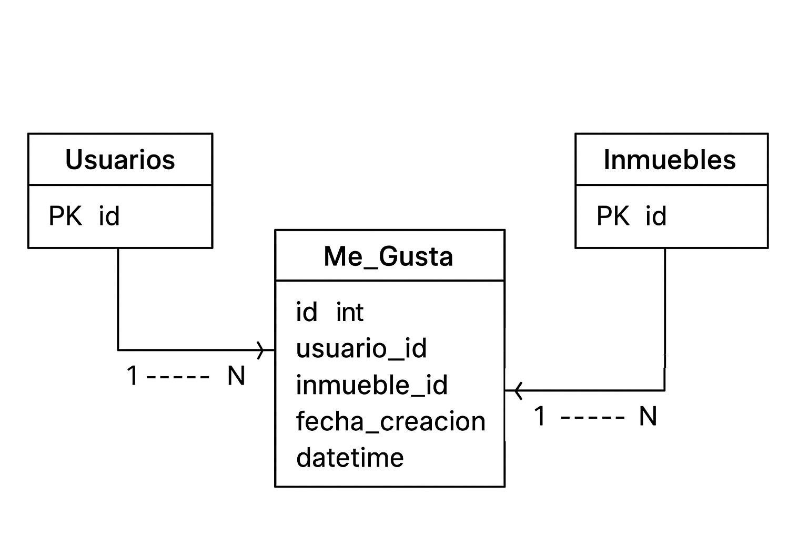

# Primer Ejercicio Habi - Microservicio de Consulta y Servicio de “Me gusta"

## Descripción del proyecto

Este proyecto forma parte de la prueba técnica para Habi y consta de dos puntos principales:

1. **Microservicio de Consulta de Inmuebles**:
   Permite que los usuarios externos puedan consultar inmuebles disponibles para la venta o pre-venta, así como inmuebles ya vendidos. Se pueden aplicar filtros por ciudad, año de construcción y estado del inmueble. Se retorna la información esencial del inmueble: Dirección, Ciudad, Estado, Precio de venta y Descripción.

2. **Microservicio conceptual de “Me gusta”**:
   Permite conceptualizar cómo los usuarios pueden dar “Me gusta” a los inmuebles, generando un ranking interno de los más atractivos. Solo se entrega el modelo de base de datos y el SQL de creación, sin implementación del microservicio.

---

## Estructura del proyecto

```
Primer_Ejercicio_Habi/
│
├── microservicio_consulta/
│   ├── servicio_consulta.py
│   ├── test_servicio_consulta.py
│   ├── bd_habi.py
│   ├── config_bd.py
│   └── filtros_entrada.json
│
├── microservicio_me_gusta/
│   ├── tabla_me_gusta.sql
│   ├── test_servicio_me_gusta.py
│   ├── diagrama_ERD.png
│   ├── agregar_me_gusta.sql
│   ├── me_gusta_entrada.json
│   └── me_gusta_salida.json
│
└── README.md
```

---

## Tecnologías utilizadas
- **Python 3.10+**: Lógica de negocio y consultas SQL.
- **MySQL**: Base de datos relacional.
- **SQL puro**: Sin ORM, manejo directo de consultas.
- **Pruebas unitarias (`unittest`)**: Implementación de TDD.
- **JSON**: Simulación de entrada de filtros.
- **Buenas prácticas**: Código limpio, modular y autodocumentado siguiendo PEP8.

---

## Microservicio de Consulta

### Funcionalidades
- Consultar inmuebles con estados válidos: `pre_venta`, `en_venta`, `vendido`.
- Aplicar filtros combinables: Ciudad, Año de construcción, Estado.
- Manejar inconsistencias en la base de datos.
- Retornar información del inmueble: Dirección, Ciudad, Estado, Precio, Descripción.

### Ejemplo de entrada JSON
Archivo: `filtros_entrada.json`
```json
{
    "ciudad": "Bogotá",
    "ano_construccion": 2018,
    "estado": ["pre_venta", "en_venta"]
}
```

### Uso
1. Modificar los datos de conexión en `servicio_consulta.py`.
2. Ejecutar script:
```bash
python microservicio_consulta/servicio_consulta.py
```
3. Ejecutar pruebas unitarias:
```bash
python -m unittest microservicio_consulta/test_servicio_consulta.py
```

---

## Microservicio de “Me gusta” (Conceptual)

### Modelo de base de datos
- Tabla `usuarios`: Información básica de los usuarios.
- Tabla `inmuebles`: Información básica de los inmuebles.
- Tabla `me_gusta`: Relación entre usuarios e inmuebles con fecha de registro y restricción de unicidad (`UNIQUE(usuario_id, inmueble_id)`).

### SQL de creación
Archivo: `tabla_me_gusta.sql`
```sql
CREATE TABLE me_gusta (
    id INT AUTO_INCREMENT PRIMARY KEY,
    usuario_id INT NOT NULL,
    inmueble_id INT NOT NULL,
    fecha_creacion DATETIME NOT NULL DEFAULT CURRENT_TIMESTAMP,
    CONSTRAINT fk_me_gusta_usuario
        FOREIGN KEY (usuario_id)
        REFERENCES usuarios(id)
        ON DELETE CASCADE,
    CONSTRAINT fk_me_gusta_inmueble
        FOREIGN KEY (inmueble_id)
        REFERENCES inmuebles(id)
        ON DELETE CASCADE,
    CONSTRAINT uq_me_gusta UNIQUE (usuario_id, inmueble_id)
) ENGINE=InnoDB DEFAULT CHARSET=utf8mb4;
```

### Consulta para agregar un “me gusta”
Archivo: `agregar_me_gusta.sql`
```sql
INSERT IGNORE INTO me_gusta (usuario_id, inmueble_id)
VALUES (1, 42);
```
*Nota:* Evita duplicados gracias a la restricción de unicidad.

### Ejemplo JSON de salida
Archivo: `me_gusta_salida.json`
```json

  {
    "id": 1,
    "usuario_id": 1,
    "inmueble_id": 42,
    "fecha_creacion": "2025-08-30T16:30:00"
  }

```

### Diagrama ERD
Archivo: `diagrama_ERD.png`
```text
usuarios
+----+---------+
| id | nombre  |
+----+---------+
    |
    | 1
    |
    | N
me_gusta
+----+------------+------------+---------------------+
| id | usuario_id  | inmueble_id | fecha_creacion     |
+----+------------+------------+---------------------+
    |
    | N
    |
    | 1
inmuebles
+----+------------+
| id | direccion  |
+----+------------+
```


### Decisión de diseño
1. Tabla independiente `me_gusta` para registrar la relación N:M.
2. Restricción de unicidad (`usuario_id`, `inmueble_id`) para evitar duplicados.
3. Claves foráneas con `ON DELETE CASCADE` para mantener integridad referencial.
4. Fecha de creación (`fecha_creacion`) para historial y análisis.

---

## Pruebas Unitarias
- Cobertura de filtros por ciudad, año de construcción, estado y combinaciones.
- Ubicadas en `test_servicio_consulta.py`.
- Permite validar la lógica de consulta y la correcta manipulación de datos.

---

## Buenas prácticas implementadas
1. Código modular y limpio.
2. Validaciones de entrada.
3. Manejo de errores y excepciones.
4. TDD con `unittest`.
5. Documentación completa con docstrings.

---

## Cómo abordar la prueba
1. Clonar el repositorio.
2. Configurar la base de datos con datos de prueba.
3. Ejecutar microservicio de consulta y probar filtros JSON.
4. Revisar resultados y cumplimiento de requisitos.
5. Revisar propuesta conceptual de “Me gusta” en SQL y diagrama ERD.
6. Ejecutar pruebas unitarias para verificar funcionalidad.

---

## Notas finales
- Se utilizó SQL puro y Python sin frameworks ni ORM.
- Código limpio, mantenible y con manejo de errores.
- Se cumplen todos los requerimientos funcionales y no funcionales de la prueba técnica.

## Autor
**Msc. Inteligencia Artificial Cristian David Villate Martínez**

